# PolySignal-OS — Live Architecture

**As of `main` at `0e0ec34` (2026-05-25, after S44 + S45 merge).**

Sourced from `brain/memory.md` and the verified code in this repo. Every node on the diagram maps to a real file or function — no aspirational nodes. The status flags reflect the system's behavior *as observed live* in S45 cycles, not its design intent.

## Status legend

| Flag | Meaning |
|---|---|
| 🟢 **WORKING** | Live and doing the job it was built to do. |
| ⚪ **GATED-OFF** | Code path present but a default-false env flag short-circuits it. Intentionally inert until the root cause is fixed. |
| 🟡 **KNOWN-MISCALIBRATED** | Live and running, but its measurement is wrong. The root cause of the suppressing nodes. |
| 🔴 **ACTIVELY-SUPPRESSING** | Live and currently filtering out real candidates on real cycles. Not a future domino — actively in the way today. |
| 🔵 **EXTERNAL / UNKNOWN** | Outside the live process, or the open question the whole system exists to answer. |

## The map

```mermaid
flowchart TB
    %% --- status styles ---
    classDef working    fill:#d4edda,stroke:#28a745,color:#155724
    classDef gated      fill:#e2e3e5,stroke:#6c757d,color:#383d41,stroke-dasharray:4 4
    classDef miscal     fill:#fff3cd,stroke:#d39e00,color:#856404,stroke-width:2px
    classDef suppress   fill:#f8d7da,stroke:#dc3545,color:#721c24,stroke-width:2px
    classDef external   fill:#cce5ff,stroke:#004085,color:#004085

    %% =========================================================
    %% DEPLOY LAYER — DGX is a one-way mirror of origin/main
    %% =========================================================
    subgraph DEPLOY [" DGX is a mirror of GitHub origin/main "]
        GH[("GitHub origin/main")]:::external
        CRON["*/10 cron<br/>git reset --hard origin/main<br/>cube crontab"]:::working
        DPATH["polysignal-deploy.path<br/>watches lab/.deploy-trigger<br/>→ scripts/deploy-handler.sh"]:::working
        WT["DGX /opt/loop<br/>working tree"]:::working
        GH -->|every 10 min| CRON
        CRON --> WT
        DPATH -->|git reset + pytest + restart| WT
    end

    %% =========================================================
    %% SCANNER → PERCEPTION (with mode branch)
    %% =========================================================
    WT --> SCAN
    SCAN["polysignal-scanner.service<br/>workflows/scanner.py<br/>5-min cycles"]:::working
    SCAN --> PER
    PER["perception_node<br/>workflows/masterloop.py:221"]:::working
    PER --> FETCH
    FETCH["fetch_all_liquid_markets<br/>lab/experiments/bitcoin_signal.py:134 (S44)<br/>gamma end_date 0.25..7d, MIN_LIQUIDITY=1000"]:::working
    FETCH --> DET{"detect_signals<br/>bitcoin_signal.py:195<br/>≥5pp in 15m/1h windows?"}
    DET -->|0 signals| OBSQ["observations = all ~300 markets<br/>(quiet-mode)"]:::working
    DET -->|≥1 signal| OBSS["observations = N signal markets<br/>(signal-mode)"]:::working

    %% =========================================================
    %% PREDICTION_NODE GATE SEQUENCE (in actual code order)
    %% =========================================================
    OBSQ --> PREDN
    OBSS --> PREDN
    PREDN["prediction_node<br/>workflows/masterloop.py:305"]:::working

    PREDN --> G1
    G1["1. META-GATE<br/>masterloop.py:315-360<br/>halt if 7d acc &lt; 40% over ≥15 evals"]:::gated
    G1 --> G2
    G2["2. EXCLUDED_MARKETS<br/>masterloop.py:365<br/>7 hardcoded stale IDs"]:::working
    G2 --> G3
    G3["3. Near-decided filter<br/>masterloop.py:381-393<br/>keep 0.15 ≤ price ≤ 0.85"]:::working
    G3 --> G4
    G4["4. Volatility gate<br/>masterloop.py:399-430<br/>7d swing ≥ 0.0005 OR no history"]:::working
    G4 --> P5
    P5["5. Base-rate predictor<br/>base_rate_predictor.py:from_all_sources<br/>(outcomes / observations / price_levels)"]:::working
    P5 --> P6
    P6["6. Momentum fallback<br/>core/predict.py:predict_market_moves<br/>+ signal enhancement masterloop.py:488"]:::working
    P6 --> G7
    G7["7. Staleness check (S45 fix)<br/>masterloop.py:_check_staleness<br/>30-min time-window, ≥5 records, ≤2 unique"]:::working
    G7 --> G8
    G7 --> G9
    G8["8. Base-rate gate<br/>masterloop.py:562-577<br/>Neutral suppressed; conf &lt; 0.50 suppressed"]:::working
    G9["9. Momentum / XGBoost gate<br/>masterloop.py:579-624<br/>Bearish skip + XGBoost p_correct ≥ 0.5"]:::suppress
    G8 --> REC
    G9 --> REC

    %% Bearish ban — appears in TWO places, drawn as a single node
    BAN["Bearish ban<br/>base_rate_predictor.py:64 BAN_BEARISH_OUTPUT<br/>+ masterloop.py:606 momentum bearish skip<br/>Session 40, defensive"]:::suppress
    P5 -. "Bearish dominant → Neutral 0.0" .-> BAN
    BAN -. "feeds Neutral into BR gate" .-> G8
    G9 -. "skips Bearish hypotheses" .-> BAN

    %% =========================================================
    %% OUTPUT + EVALUATOR + FEEDBACK
    %% =========================================================
    REC["record_predictions<br/>outcome_tracker.py:210<br/>(dual-horizon 4h+24h)"]:::working
    REC --> OUT
    OUT[("prediction_outcomes.json<br/>/opt/loop/data/")]:::working

    TB["polysignal-truth-board.timer<br/>every ~15 min<br/>lab/truth_board.py"]:::working
    TB --> EV
    EV["evaluate_outcomes<br/>outcome_tracker.py:292-402<br/>delta = price_now − price_then over 4h/24h<br/>vs MIN_MOVE_THRESHOLD=0.0005"]:::miscal
    OUT -. read .-> EV
    EV -. "writes labels (noise)<br/>CORRECT/INCORRECT/NEUTRAL" .-> OUT

    FB["polysignal-feedback.timer (daily 05:00)<br/>lab/feedback_loop.py:226<br/>writes .retrain-trigger on bad accuracy"]:::gated
    OUT --> FB

    %% =========================================================
    %% XGBOOST MODEL — trained on noise → suppressing
    %% =========================================================
    XGB[("XGBoost model<br/>data/models/xgboost_baseline.pkl<br/>(trained 2026-04-15 on noise labels)")]:::suppress
    OUT -. "training labels<br/>(from miscalibrated evaluator)" .-> XGB
    XGB -. "p_correct check rejects<br/>100% of momentum candidates" .-> G9

    %% =========================================================
    %% LOOP — autonomous control plane
    %% =========================================================
    subgraph LOOPSUB [" Loop — autonomous control plane "]
        LOOP["openclaw-gateway.service<br/>120-min heartbeat + continuous work loop<br/>HEARTBEAT.md / AUTONOMY_SPEC.md:52"]:::working
        TD["lab/.deploy-trigger"]:::working
        TR["lab/.restart-scanner"]:::working
        TP["lab/.git-push-request"]:::working
        TT["lab/.retrain-trigger"]:::working
        LOOP -- writes --> TD
        LOOP -- writes --> TR
        LOOP -- writes --> TP
        LOOP -- writes --> TT
    end

    RET["retrain_handler.sh<br/>polysignal-retrain.path<br/>+ lab/retrain_pipeline.py"]:::suppress
    TD --> DPATH
    TR -. "polysignal-scanner-restart.path<br/>restart scanner" .-> SCAN
    TP -. "polysignal-git-push.path<br/>git-push-handler.sh push to loop/*" .-> GH
    TT --> RET
    FB -. "would write (GATED-OFF)" .-> TT
    RET -. "would re-train + swap model<br/>on noise labels" .-> XGB

    %% =========================================================
    %% ROOT-CAUSE EDGES (thick, the dependency chain)
    %% =========================================================
    EV ==>|"S40: noise made Bearish<br/>look like 5.6% accuracy →<br/>defensive ban"| BAN
    EV ==>|"trained XGBoost on noise →<br/>model now rejects everything"| XGB

    %% =========================================================
    %% THE ONE UNKNOWN — what the system exists to answer
    %% =========================================================
    EDGE[/"❓ Real model edge<br/>pending N≥30 resolved markets<br/>scored vs actual Polymarket resolution<br/>eval/resolution_backtest.py (S44)"/]:::external
    OUT -. "when N≥30 reached" .-> EDGE
```



## Node-to-source table

| Node | Source | Status | Notes |
|---|---|---|---|
| GitHub `origin/main` | github.com/Karl-W-W/polysignal-engine | 🔵 | Single source of truth for deploys |
| `*/10` cron | `cube` crontab line 1 | 🟢 | `git reset --hard origin/main` every 10 min |
| `polysignal-deploy.path` / `.service` | `~/.config/systemd/user/polysignal-deploy.{path,service}` + `scripts/deploy-handler.sh` | 🟢 | Triggered by `.deploy-trigger`; does git-reset + pytest + restart |
| DGX `/opt/loop` working tree | the host filesystem | 🟢 | One-way mirror — direct edits get wiped within 10 min |
| `polysignal-scanner.service` | `polysignal-scanner.service` + `workflows/scanner.py` | 🟢 | 5-min cycles, `Restart=on-failure` |
| `perception_node` | `workflows/masterloop.py:221` | 🟢 | Calls `fetch_crypto_markets()` |
| `fetch_all_liquid_markets` | `lab/experiments/bitcoin_signal.py:134` (S44) | 🟢 | Server-side `end_date_min`/`end_date_max` window + client-side `_within_horizon` re-check |
| `detect_signals` | `lab/experiments/bitcoin_signal.py:195` | 🟢 | Branches the flow into quiet-mode vs signal-mode |
| **1. META-GATE** | `workflows/masterloop.py:315-360` | ⚪ | `META_GATE_ENABLED=false` (default, S44). Would halt all predictions if 7d rolling acc < 40%; gated off because that accuracy comes from the miscalibrated evaluator |
| **2. EXCLUDED_MARKETS** | `workflows/masterloop.py:365` + `bitcoin_signal.py:47` | 🟢 | 7 hardcoded stale market IDs |
| **3. Near-decided filter** | `workflows/masterloop.py:381-393` | 🟢 | Keep 0.15 ≤ price ≤ 0.85 |
| **4. Volatility gate** | `workflows/masterloop.py:399-430` | 🟢 | 7-day price swing ≥ 0.0005 OR no observation history |
| **5. Base-rate predictor** | `lab/base_rate_predictor.py:from_all_sources` (line 267) | 🟢 | Merges `from_outcomes` / `from_observations` / `from_price_levels` |
| **Bearish ban** | `lab/base_rate_predictor.py:64` (`BAN_BEARISH_OUTPUT`) + `:353-361` + `workflows/masterloop.py:606` | 🔴 | Forces Bearish → Neutral 0.0 in base-rate; skips Bearish in momentum gate. Added Session 40 because the noise evaluator scored Bearish 5.6% |
| **6. Momentum fallback** | `core/predict.py:predict_market_moves` + `workflows/masterloop.py:477+` + signal enhancement `:488` | 🟢 | Old "toy" predictor, with signal-enhancement bolted on |
| **7. Staleness check** | `workflows/masterloop.py:_check_staleness` (S45 fix) | 🟢 | 30-min time-window; `STALE_LOOKBACK_MINUTES=30`, `STALE_MIN_RECENT=5`, `STALE_COOLDOWN=6` |
| **8. Base-rate gate** | `workflows/masterloop.py:562-577` | 🟢 | Suppress hyp==Neutral; suppress conf < 0.50 |
| **9. Momentum / XGBoost gate** | `workflows/masterloop.py:579-624` + `lab/xgboost_baseline.py` | 🔴 | Suppresses Neutral, Bearish; XGBoost `p_correct ≥ 0.5` required |
| `record_predictions` | `lab/outcome_tracker.py:210` | 🟢 | Writes records with dual-horizon (4h + 24h) |
| `prediction_outcomes.json` | `/opt/loop/data/prediction_outcomes.json` | 🟢 | The system's labelled history. Currently 632 records, 146/325/0.31 |
| `polysignal-truth-board.timer` | `~/.config/systemd/user/polysignal-truth-board.timer` + `lab/truth_board.py` | 🟢 | Fires `evaluate_outcomes()` every ~15 min |
| `evaluate_outcomes` | `lab/outcome_tracker.py:292-402` (scoring at `:343-357`, threshold at `:115`) | 🟡 | Scores `delta = price_now − price_then` over 4h/24h vs `MIN_MOVE_THRESHOLD = 0.0005`. **This is the root cause.** 82% of 598 historical verdicts rest on sub-0.5pp tick noise (S44 backtest) |
| `polysignal-feedback.timer` | `~/.config/systemd/user/polysignal-feedback.timer` + `lab/feedback_loop.py` | ⚪ | Auto-retrain trigger-write at `:226-235` is gated by `AUTO_RETRAIN_ENABLED=false` (S44) |
| `xgboost_baseline.pkl` | `/opt/loop/data/models/xgboost_baseline.pkl` (2026-04-15) | 🔴 | Trained on the miscalibrated evaluator's labels |
| `retrain_handler.sh` / `retrain_pipeline.py` | `lab/retrain_handler.sh` + `lab/retrain_pipeline.py` | 🔴 | Trains on `prediction_outcomes.json` (noise-labelled), would swap the model + restart the scanner. Held off only because the `.retrain-trigger` writer is gated |
| **Loop** | `openclaw-gateway.service` + `lab/HEARTBEAT.md` + `lab/AUTONOMY_SPEC.md:52` | 🟢 | 120-min heartbeat + continuous work loop. Has authority to write all four trigger files |
| `.deploy-trigger` writer | Loop (sandbox path `/mnt/polysignal/lab/.deploy-trigger`) | 🟢 | Triggers a deploy → `git reset --hard origin/main` + restart |
| `.restart-scanner` writer | Loop | 🟢 | Restarts the scanner |
| `.git-push-request` writer | Loop | 🟢 | Pushes a `loop/*` branch via `scripts/git-push-handler.sh` |
| `.retrain-trigger` writer | Loop **+** `feedback_loop.py:226` (gated) | 🟢 / ⚪ | The feedback-loop writer is gated; Loop can still write it directly |
| **Real model edge** | `eval/resolution_backtest.py` (S44) — pending N≥30 | 🔵 | The one unknown the system exists to answer |

## The root-cause chain

Both `ACTIVELY-SUPPRESSING` nodes trace back to a single `KNOWN-MISCALIBRATED` node. This is the chain the system has to break:

```
evaluate_outcomes (4h-drift, MIN_MOVE_THRESHOLD=0.0005)
        │
        ├── writes noise-labelled outcomes (CORRECT/INCORRECT)
        │        │
        │        ├── XGBoost is trained on these → rejects all momentum candidates
        │        │   (S45 cycle 3: momentum gate 0/2 passed, both p_correct < 0.5)
        │        │
        │        └── Per-market accuracy shows Bearish at 5.6% (Session 40 finding)
        │                  → defensive Bearish ban was added
        │                  → S45 cycle 3: base-rate gate 0/4 passed,
        │                    all 4 Bearish candidates → Neutral 0.0 → suppressed
        │
        └── feeds META-GATE rolling accuracy → would halt scanner at <40%
                  → META-GATE was gated off (S44)
```

**Fix the evaluator and three other things become safe:**
- The Bearish ban becomes removable (Bearish wasn't actually 5.6% — that was the noise).
- The XGBoost model becomes safely re-trainable (labels would be real).
- `META_GATE_ENABLED` can be turned back on (it would be reading real accuracy).

The current `eval/resolution_backtest.py` already scores against actual Polymarket resolution rather than 4h drift — it's the reference implementation for what the live evaluator should do, and it needs N≥30 resolved markets to deliver a verdict.

## The autonomous control plane (Loop)

Loop's runtime is `openclaw-gateway.service`. Per `lab/AUTONOMY_SPEC.md:52`, Loop is permitted to deploy, push to CI branches, and merge PRs. In practice it does this by writing one of four trigger files; each fires a systemd `.path` unit that runs a host-side handler:

| Trigger | Watcher | Handler | Effect |
|---|---|---|---|
| `lab/.deploy-trigger` | `polysignal-deploy.path` | `scripts/deploy-handler.sh` | `git reset --hard origin/main` + pytest + restart scanner |
| `lab/.restart-scanner` | `polysignal-scanner-restart.path` | systemd restart | restart scanner |
| `lab/.git-push-request` | `polysignal-git-push.path` | `scripts/git-push-handler.sh` | push current branch to `loop/*` on origin |
| `lab/.retrain-trigger` | `polysignal-retrain.path` | `lab/retrain_handler.sh` → `retrain_pipeline.py` | retrain XGBoost on `prediction_outcomes.json`, swap model if better, restart scanner |

These give Loop the ability to change the live state at any moment. During a deploy window, **all four `.path` units plus `openclaw-gateway.service` itself must be paused** — the `*/10` cron alone is not enough.

## The one unknown the whole system exists to answer

**Does PolySignal predict markets better than the market itself?**

The answer requires `N ≥ 30` resolved Polymarket markets scored by `eval/resolution_backtest.py` (S44) — comparing the model's call to the actual YES/NO outcome, not the 4h-drift evaluator's labels. As of `0e0ec34`:

- 1 resolved (Man City EPL — Bullish, resolved NO, 0/1 = 0% on N=1).
- 3 unresolved long-horizon (France WC, PSG CL, US-Iran).
- The new short-horizon universe (S44) has begun producing predictions on markets that should resolve within 7 days; the rate is **mode-dependent** — 35–60/day in quiet-mode, 0 today in signal-mode while the Bearish ban + XGBoost gate suppress everything.

N≥30 is reachable on the order of 1–3 weeks once the suppression vectors are addressed. Estimated milestone: mid-to-late June 2026.

## How to keep this map honest

A node belongs on this diagram only if it satisfies all three:
1. It corresponds to a real file, function, or systemd unit that *runs* on the live DGX (`/opt/loop`) — not a planned, sketched, or "in progress" thing.
2. It can be cited by `path:line` or by systemd unit name.
3. Its status flag matches its *observed* behavior in a recent cycle, not its design intent.

If a planned change or feature isn't yet live, it lives in `brain/memory.md` under the relevant session's "next dominoes" section, not on this map. When something becomes live, it gets added here with the citation that proves it's there.

The 4-status legend is non-negotiable: avoid inventing intermediate states ("partially working", "mostly off") — they obscure the actual call-to-action. If the answer depends on which cycle you watch, list both modes (as `detect_signals` does here for quiet-mode vs signal-mode).
